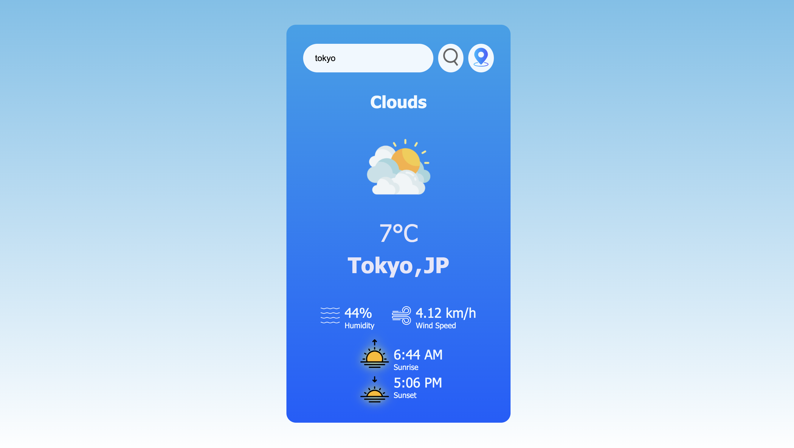

# Weather Now
Weather Now is an immersive and dynamic JavaScript-based weather application that provides real-time weather information for any city. It allows users to search for weather conditions, view the current temperature, humidity, wind speed, and check sunrise and sunset times.

(https://main--jimitrawal-weather-now.netlify.app)

Day Theme

Night Theme

## Features

- **Real-Time Weather Data**: Search for current weather conditions in any city
- **Current Location**: Get weather updates based on your current location.
- **Interactive Weather Icons:s**: Display appropriate weather icons dynamically based on the weather conditions and time of day. 

## Getting Started

To run Weather Now, follow these steps:

1. Clone this repository to your local machine.
2. Obtain an API key from OpenWeatherMap and Sunrise Sunset.
3. Replace the placeholders in the script with your API keys:
   const apiKey = "your_openweathermap_api_key";
5. Open the index.html file in your web browser.

## Usage

Weather Now supports various actions through its user interface:

- Search for Weather: Enter a city name in the search bar and click the search button to get weather details.
- Current Location Weather: Click the location button to get weather updates for your current location
